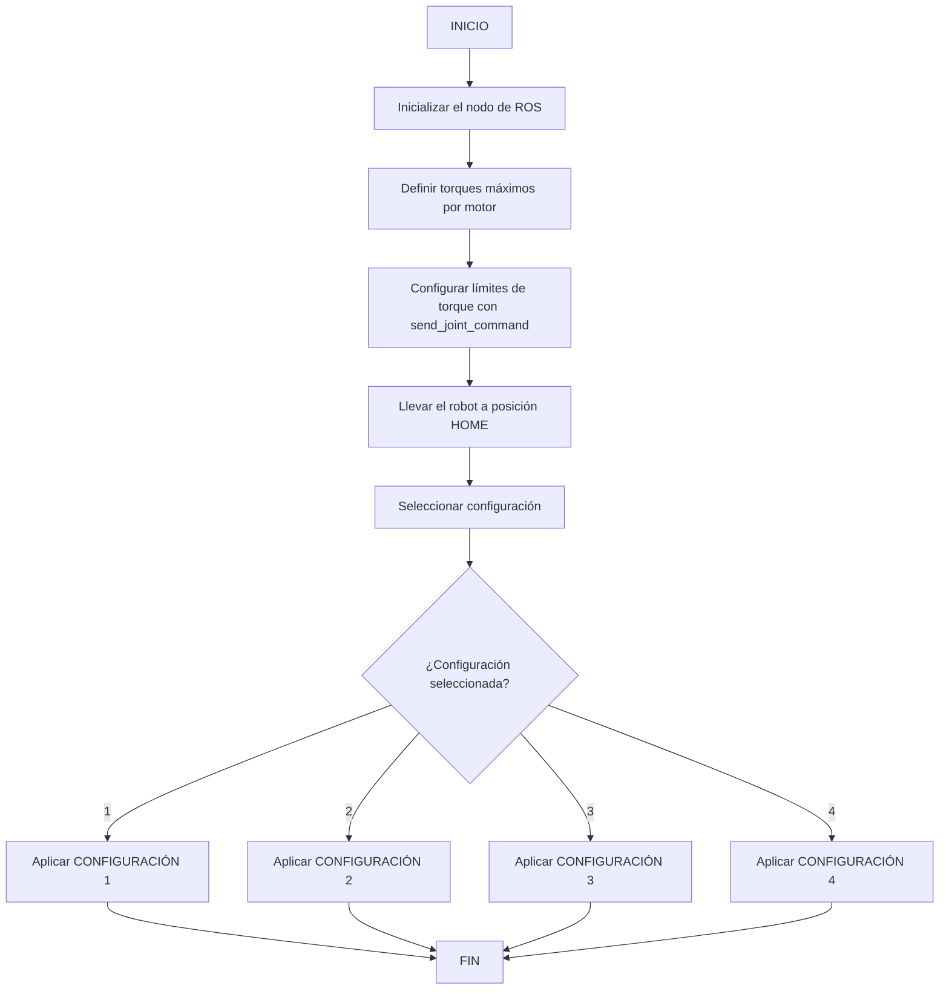

# Laboratorio 4 - Cinemática Directa con ROS 2
## PhantomX Pincher X100 | Mecatrónica UNAL 2025-I

### Integrantes del Grupo
Esta práctica se llevó a cabo con la participación conjunta de los integrantes de dos grupos de laboratorio.

| Andrés Mauricio Avilán |
| Juan David Meza |
| Hector Andrés Aponte Porras.. |
| Juan Manuel .. |

---

## Modelado Cinemático

El modelado matemático del manipulador incluye:

- Diagrama robot`


- Tabla de parámetros DH estándar (Denavit–Hartenberg)

---

## Descripción de la Solución Planteada

El script `macarena.py` desarrollado para controlar el manipulador PhantomX Pincher X100 está basado en ROS 2 y hace uso de los servicios de Dynamixel para controlar las articulaciones del brazo.

---

## Diagrama de Flujo del script macarena.py`



## Configuración ROS 2 - `macarena`

Este proyecto está desarrollado en **ROS 2 Humble**, y usa el paquete `dynamixel_sdk` para la comunicación con los motores del manipulador.
Para lanzar el sistema completo:

ros2 launch phanthon_control macarena.py


### 🔧 Configuración de Torque y Análisis de Límites de Movimiento

Antes de realizar cualquier tipo de movimiento con el manipulador, fue necesario identificar tanto los **valores máximos de torque permitidos para cada motor** como los **límites físicos de movimiento** de cada articulación expresados en **pulsos y grados**.

#### Torques máximos permitidos por motor

Estos valores fueron ajustados empíricamente para asegurar un movimiento suave y seguro, evitando vibraciones y pérdida de fuerza en posiciones extremas:

```python
torques = [500, 400, 350, 350, 350]  # [waist, shoulder, elbow, wrist, gripper]
```

---

### Análisis de límites de pulsos y conversión a grados

Para tener control preciso sobre las articulaciones, se midieron los límites de pulsos y su correspondencia con ángulos reales, permitiendo definir rangos válidos y realizar conversiones confiables entre grados y pulsos. Este análisis fue clave para programar movimientos seguros, sin sobrepasar los límites físicos del robot.

| Articulación  | Pulsos mínimo-máximo | Rango Angular estimado | Pulsos para 90° |
|---------------|----------------------|-------------------------|------------------|
| **x1 (cadera)**   | 0 – 657               | ~0° – 205°               | 290              |
| **x2 (hombro)**   | 220 – 804             | ~0° – 180°               | 290              |
| **x3 (codo)**     | 80 – 944              | ~-45° – 225°             | 290              |
| **x4 (muñeca)**   | 200 – 824             | ~0° – 180°               | 312              |
| **x5 (gripper)**  | 0 – 512               | ~4 mm – 38 mm (apertura) | —                |

> Con esta tabla, fue posible establecer funciones de conversión entre grados ↔ pulsos para programar los movimientos con precisión, evitando zonas peligrosas de saturación o colisión entre eslabones.

---

### Función de Envío de Comandos

Se definió una función central llamada `macarena` para encapsular la lógica de comunicación con los motores Dynamixel:

```python

aqui todo codigo python

#!/usr/bin/env python3
import rclpy
from rclpy.node import Node
from dynamixel_sdk import PortHandler, PacketHandler
import time

ADDR_TORQUE_ENABLE    = 24
ADDR_GOAL_POSITION    = 30
ADDR_MOVING_SPEED     = 32
ADDR_TORQUE_LIMIT     = 34

class Macarena(Node):
    def __init__(self):
        super().__init__('macarena_node')

        port_name = '/dev/ttyUSB0'
        baudrate = 1000000
        dxl_ids = [1, 2, 3, 4]  # waist, shoulder, elbow, wrist
        home_pos = [512, 512, 512, 512]
        target_pos = [600, 600, 400, 300]
        speed = 100
        torque = 1000

        port = PortHandler(port_name)
        packet = PacketHandler(1.0)

        if not port.openPort():
            self.get_logger().error("No se pudo abrir el puerto")
            return
        port.setBaudRate(baudrate)

        # Mover a home
        self.get_logger().info("Moviendo a posición HOME...")
        for i, dxl_id in enumerate(dxl_ids):
            packet.write2ByteTxRx(port, dxl_id, ADDR_TORQUE_LIMIT, torque)
            packet.write2ByteTxRx(port, dxl_id, ADDR_MOVING_SPEED, speed)
            packet.write1ByteTxRx(port, dxl_id, ADDR_TORQUE_ENABLE, 1)
            packet.write2ByteTxRx(port, dxl_id, ADDR_GOAL_POSITION, home_pos[i])
            self.get_logger().info(f'[ID {dxl_id}] → {home_pos[i]}')
            time.sleep(1)

        time.sleep(2)

        # Mover a posición objetivo
        self.get_logger().info("Moviendo a posición OBJETIVO...")
        for i, dxl_id in enumerate(dxl_ids):
            packet.write2ByteTxRx(port, dxl_id, ADDR_GOAL_POSITION, target_pos[i])
            self.get_logger().info(f'[ID {dxl_id}] → {target_pos[i]}')
            time.sleep(1)

        time.sleep(2)

        port.closePort()
        rclpy.shutdown()

def main(args=None):
    rclpy.init(args=args)
    Macarena()

if __name__ == '__main__':
    main()

```

**Parámetros:**

- `port = PortHandler(port_name)
packet = PacketHandler(1.0)
`: El código usa dynamixel_sdk para conectarse con los motores mediante un puerto serie (/dev/ttyUSB0) y una velocidad de transmisión de 1 Mbps. Esto es esencial para que la comunicación entre el controlador y los servomotores sea posible.
- `ADDR_TORQUE_ENABLE = 24
ADDR_GOAL_POSITION = 30
ADDR_MOVING_SPEED = 32
ADDR_TORQUE_LIMIT  = 34
`: Estas direcciones son necesarias para enviar comandos correctos a cada motor, como habilitar torque, establecer velocidad, límite de torque y posición.
- `packet.write2ByteTxRx(..., ADDR_GOAL_POSITION, home_pos[i])
...
packet.write2ByteTxRx(..., ADDR_GOAL_POSITION, target_pos[i])
`: Esto demuestra cómo se puede controlar directamente cada articulación de un brazo robótico, con temporización (time.sleep) entre comandos para permitir que los motores lleguen a su posición..
- `class Macarena(Node):`: También, el uso de rclpy.init() y rclpy.shutdown() muestra cómo se gestiona el ciclo de vida del nodo, incluso si no hay suscriptores o editores, permitiendo control directo desde el nodo principal.
Esta función se usa para configurar torques, mover motores a HOME y moverlos a poses específicas.

---

### Video de ejecución secuencial

El video de la rutina completa del manipulador ejecutando las poses


---

### Comparación de poses digitales vs reales

A continuación se muestra una tabla con las comparaciones entre la simulación digital y la fotografía real del manipulador:


---

## Conclusiones


